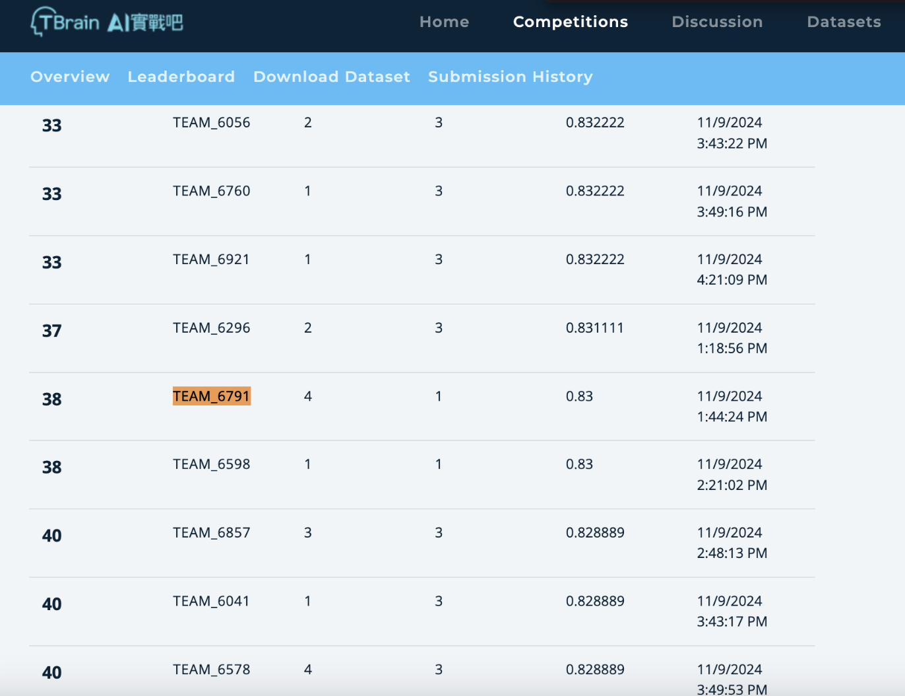

# AI CUP 2024 玉山人工智慧公開挑戰賽－RAG與LLM在金融問答的應用
＊＊ High-Accuracy RAG Retriever Template ＊＊

## Result

- Total: 38 / 487 Teams
   - Leaderboard: 38 / 222



## Development Mode
To set up the development environment, follow these steps:

1. Create a virtual environment:
   ```
   python3 -m venv aicup_venv
   source aicup_venv/bin/activate
   ```

2. Install the required dependencies:
   ```
   pip install -r requirements.txt
   ```

3. Copy the configuration example and create your own config file:
   ```
   cp config_example.ini config.ini
   ```

4. Manually add your `secret key` to the `config.ini`.

5. Create a `logs` directory:
   ```
   mkdir logs
   ```

6. Navigate to the `docker` directory (optional):
   ```
   cd docker
   ```

7. Start the Docker environment (optional):
   ```
   docker-compose up -d
   ```

8. Run the Flask app:
   ```
   python3 src/flask_app.py
   ```

## Docker Production Mode

1. Copy the configuration example and create your own config file:
   ```
   cp config_example.ini config.ini
   ```

2. Manually add your `secret key` to the `config.ini`.

3. Create a `logs` directory:
   ```
   mkdir logs
   ```

4. Navigate to the `docker` directory:
   ```
   cd docker
   ```

5. Start the Docker environment:
   ```
   docker-compose up -d
   ```

6. Build the Docker image:
   ```
   docker build -t aicup_img -f dockerfile .
   ```

7. Run the Docker container:
   ```
   docker run -d -p 5001:5001 --name aicup_cont aicup_img
   ```

## Folder-specific Details
For more detailed information about each folder and its purpose, refer to the individual `README.md` files located in their respective directories.

## Contribution Guide (Optional)
We follow GitHub Flow for contributing. The steps are as follows:

1. **Claim an issue**: Start by picking an issue from GitHub.
2. **Create a branch**: Open a new branch with a clear name related to the issue (e.g., `feat/xxxxx-feature`).
3. **Development**: After completing the feature, ensure you run pre-commit hooks:
   ```
   pre-commit run --all-files
   ```
4. **Create PR Request (PR)**:
   - Ensure your PR is small and easily reviewable.
   - Add the GitHub issue number to the PR title in the format `feat(#123): xxxxxx` for easy reference.
   - Write a clear description including the reason for the change and what was modified (`Reason & Changes`).
5. **Review & Approval**:
   - Assign the PR to all members of the team for review.
   - Wait for at least one approval.
   - Ensure all CI checks pass.
6. **Merge**: Once approved and CI passes, merge the branch into `main` yourself.

## Additional Notes (Optional)
- Keep your commits focused and ensure meaningful commit messages.
- Always rebase your branch on top of `main` before merging.
- Avoid large, multi-purpose PRs. Smaller changes are easier to review and help prevent issues.
